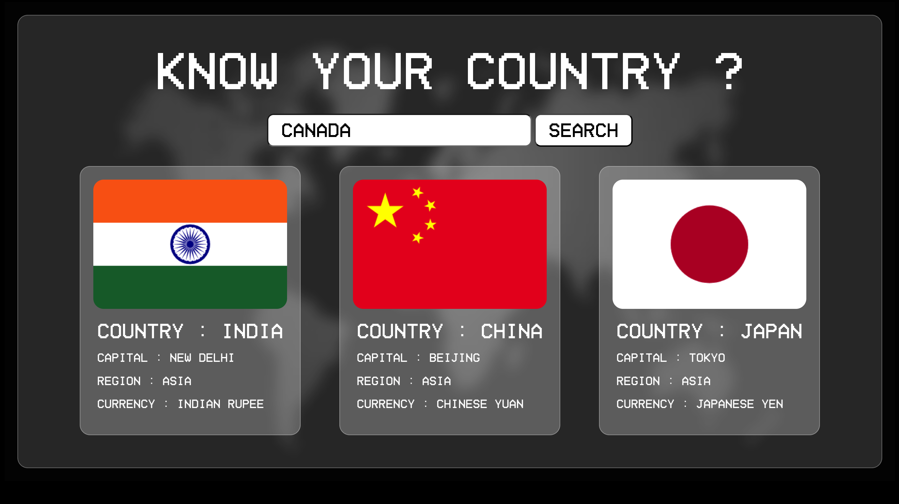
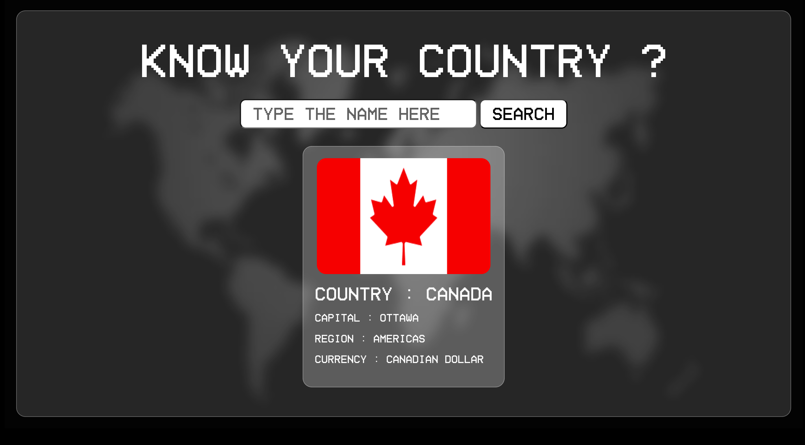

# 🌍 Know Your Country

A simple and interactive web application that allows users to explore country details such as **flag, capital, region, and currency** using the public **REST Countries API**.

The application displays a few default countries on page load and allows users to **search for any country** dynamically.

---

## ✨ Features

- 🌐 Displays country information:
  - Country name
  - National flag
  - Capital city
  - Region
  - Currency
- 🔍 Search functionality to look up any country
- ⚡ Real-time data fetched from a public API
- 🎨 Clean, glassmorphism-inspired UI
- 🧠 Server-side rendering using EJS

---

## 🖼️ Screenshots

### Home Page (Default Countries)


### Search Result



---

## 🛠️ Tech Stack

- **Frontend**
  - HTML5
  - CSS3
  - EJS (Embedded JavaScript Templates)

- **Backend**
  - Node.js
  - Express.js

- **HTTP Client**
  - Axios

- **API**
  - [REST Countries API](https://restcountries.com)

---

## 🚀 How It Works

### 1. Home Route (`GET /`)
- Fetches data for default countries (`India`, `China`, `Japan`)
- Builds a structured `countriesinfo` object
- Renders country cards dynamically using EJS

### 2. Search Route (`POST /submit`)
- Accepts user input
- Normalizes input (trim + lowercase)
- Fetches data for the searched country
- Displays the result on the same page

---
## 🧪 API Example

- GET https://restcountries.com/v3.1/name/india?fullText=true


---

## ⚙️ Installation & Setup


```bash
git clone https://github.com/your-username/know-your-country.git
cd know-your-country
npm install
node index.js
```

## 📄 Open in Browser

- http://localhost:3000
